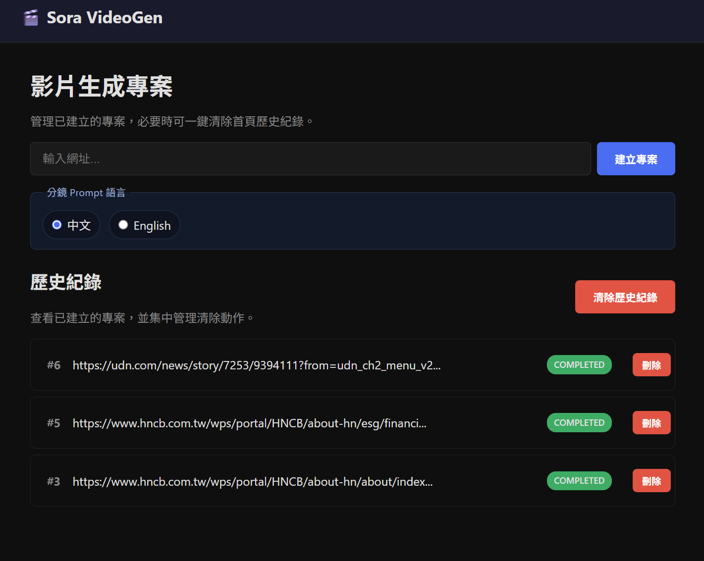
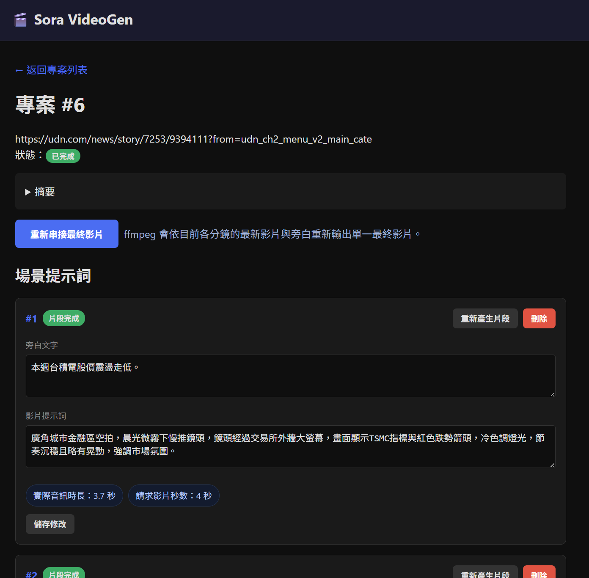
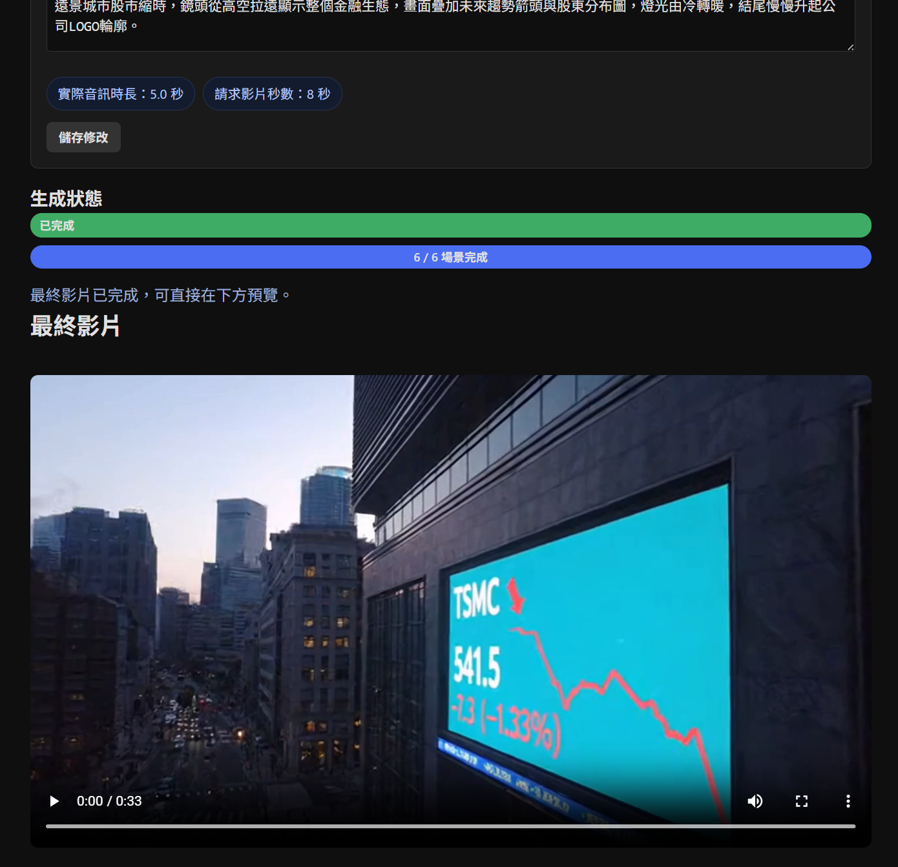

# Sora VideoGen

Sora VideoGen 是一個使用 FastAPI + Jinja2/HTMX 建置的 Web 應用程式，可將網頁文章轉換為帶有旁白的影片摘要。你只要貼上網址，系統就會擷取並摘要內容、生成可編輯的分鏡提示詞，接著產生分鏡影片片段，最後再手動串接為單一影片。

所有面向使用者的內容皆以符合台灣用語的正體中文生成。

## 功能特色

- 從公開網址擷取文章文字內容



- 生成正體中文摘要與分鏡旁白
- 在 Web 介面中建立並編輯分鏡級別的影片提示詞



- 支援以中文或英文產生分鏡 prompt，且預設為中文
- 產生 Azure Speech 旁白音訊與 Sora 2 影片分段
- 透過前一分鏡的最後影格維持畫面連續性
- 使用可切換的媒體後端將所有片段串接為最終影片，預設為 ffmpeg，也可改用 GStreamer



- 啟動時檢查 Microsoft Entra ID token 狀態，若未就緒會在首頁顯示警示

## 系統需求

- Python 3.11 以上版本
- 已安裝對應媒體後端工具，且可從 PATH 直接呼叫
	- 預設為 ffmpeg
	- 若設定 `MEDIA_BACKEND=gstreamer`，需安裝 `gst-launch-1.0`
- 用於摘要與影片生成的 OpenAI API Key，或 Azure OpenAI 部署
- 用於文字轉語音的 Azure Speech 資源
- 若使用 Microsoft Entra ID 驗證：需先完成 Azure CLI 登入，或具備可供 `DefaultAzureCredential` 使用的 Managed Identity / Service Principal

## 快速開始

### 1. 建立並啟用虛擬環境

Windows PowerShell：

```powershell
python -m venv .venv
.\.venv\Scripts\Activate.ps1
```

macOS 或 Linux：

```bash
python -m venv .venv
source .venv/bin/activate
```

### 2. 安裝相依套件

```bash
pip install -r requirements.txt
```

### 3. 設定環境變數

將 `.env.example` 複製為 `.env`。

Windows PowerShell：

```powershell
Copy-Item .env.example .env
```

macOS 或 Linux：

```bash
cp .env.example .env
```

至少需要在 `.env` 中設定 LLM / 影片生成服務，以及 Azure Speech 相關設定。

使用 OpenAI + Azure Speech 金鑰：

```env
OPENAI_API_KEY=your-openai-api-key
AZURE_SPEECH_KEY=your-azure-speech-key
AZURE_SPEECH_REGION=your-speech-region
TTS_VOICE=zh-TW-HsiaoYuNeural
```

使用 Azure OpenAI + Azure Speech 與 Microsoft Entra ID：

```env
AZURE_OPENAI_ENDPOINT=https://your-resource.openai.azure.com
AZURE_OPENAI_USE_ENTRA_ID=true
AZURE_SPEECH_USE_ENTRA_ID=true
AZURE_SPEECH_REGION=your-speech-region
AZURE_SPEECH_RESOURCE_ID=/subscriptions/<sub>/resourceGroups/<rg>/providers/Microsoft.CognitiveServices/accounts/<speech-resource>

# 這些值必須是你的 Azure OpenAI deployment 名稱。
SUMMARIZER_MODEL=gpt-5-mini
TTS_VOICE=zh-TW-HsiaoYuNeural
SORA_MODEL=sora-2
SORA_VIDEO_SIZE=1280x720
VIDEO_GENERATION_MAX_ATTEMPTS=2
VIDEO_GENERATION_RETRY_DELAY_SECONDS=45
```

若在本機使用 Microsoft Entra ID，請先登入：

```bash
az login
```

若應用程式部署在 Azure 上，請替應用程式的 Managed Identity 指派 Azure OpenAI 角色，例如 `Cognitive Services OpenAI User` 或 `Cognitive Services User`。

若使用 Microsoft Entra ID 存取 Azure Speech，請讓該身分具備 Speech 資源權限，並設定 `AZURE_SPEECH_RESOURCE_ID`。

如果你想改用 Azure OpenAI API Key 而不是 Entra ID，請設定：

```env
AZURE_OPENAI_ENDPOINT=https://your-resource.openai.azure.com
AZURE_OPENAI_API_KEY=your-azure-openai-key
AZURE_OPENAI_USE_ENTRA_ID=false
```

如果你想改用 Azure Speech 金鑰而不是 Entra ID，請設定：

```env
AZURE_SPEECH_KEY=your-azure-speech-key
AZURE_SPEECH_REGION=your-speech-region
AZURE_SPEECH_USE_ENTRA_ID=false
```

預設的 `.env.example` 也定義了：

- `DATABASE_URL=sqlite+aiosqlite:///./sora-videogen.db`
- `MEDIA_DIR=./media`
- `MEDIA_BACKEND=ffmpeg`
- `GSTREAMER_LAUNCH_BINARY=gst-launch-1.0`
- `GSTREAMER_INSPECT_BINARY=gst-inspect-1.0`
- `GSTREAMER_FRAME_SAMPLE_FPS=2`
- `APP_HOST=0.0.0.0`
- `APP_PORT=8000`
- `SORA_VIDEO_SIZE=1280x720`
- `VIDEO_GENERATION_MAX_ATTEMPTS=2`
- `VIDEO_GENERATION_RETRY_DELAY_SECONDS=45`

當啟用 Azure OpenAI 時，應用程式會自動把 OpenAI client 切換到 Azure endpoint，並依設定使用 Microsoft Entra ID 或 Azure OpenAI API Key。旁白則一律由 Azure Speech 生成。

### 4. 啟動應用程式

建議使用以下指令：

```bash
python -m app.main
```

這個進入點會從 `.env` 讀取 `APP_HOST` 與 `APP_PORT`。

如果你想直接用 uvicorn 啟動，就必須自行明確指定 host 與 port，例如：

```bash
uvicorn app.main:app --reload --host 0.0.0.0 --port 8765
```

不要預期裸跑 `uvicorn app.main:app --reload` 時，`.env` 內的 `APP_HOST` 或 `APP_PORT` 會自動生效。

第一次啟動時，應用程式會自動建立資料庫資料表。

若啟用了 Microsoft Entra ID 驗證，啟動時也會檢查是否能順利取得 Azure OpenAI / Azure Speech 所需 token；若檢查失敗，首頁會顯示警示訊息。

若 `MEDIA_BACKEND=gstreamer`，啟動時也會自動檢查 GStreamer 執行環境是否就緒；若缺少必要指令或插件，首頁同樣會顯示警示訊息。

### 5. 開啟 Web 介面

在瀏覽器開啟 `http://127.0.0.1:<APP_PORT>/`。根路徑會自動重新導向到 `/projects/`。

範例：

- 若 `APP_PORT=8000`，請開啟 `http://127.0.0.1:8000/`
- 若 `APP_PORT=8765`，請開啟 `http://127.0.0.1:8765/`

## 一般使用流程

1. 在 Web UI 建立專案。
2. 貼上文章網址。
3. 等待前置流程完成。
4. 檢查並編輯系統生成的旁白與影片提示詞。
5. 執行分鏡生成，產生各分鏡的音訊與影片片段。
6. 視需要重生單一分鏡。
7. 手動執行影片串接，輸出最終影片。
8. 到 `media/<project_id>/` 查看輸出檔案。

## Azure OpenAI 注意事項

- 使用 Azure OpenAI 時，`SUMMARIZER_MODEL` 與 `SORA_MODEL` 應設定為 Azure deployment 名稱。
- 應用程式以 `DefaultAzureCredential` 進行 Microsoft Entra ID 驗證，因此支援本機 Azure CLI 登入、Managed Identity，以及標準 Service Principal 環境變數。
- Sora 2 生成流程使用官方 `videos` API，而非圖片生成 API。
- 專案需要安裝包含 `videos` API 的 OpenAI Python SDK 版本。
- Sora 2 的片段時長會自動對應到支援的 `4`、`8`、`12` 秒。
- Sora 2 影片生成會使用已驗證的輸出尺寸；支援尺寸為 `720x1280`、`1280x720`、`1024x1792`、`1792x1024`。
- 當 Sora 任務因可重試錯誤失敗時，應用程式預設會等待 45 秒後重試一次。若帶參考影像的生成失敗，也會回退成不帶參考影像的普通生成。
- `SCENE_DURATION_SECONDS` 是上限值，但實際的單分鏡限制還會再被 Sora 可支援的最大時長約束。

## Azure Speech 注意事項

- 旁白透過 `azure-cognitiveservices-speech` SDK 使用 Azure AI Speech 生成。
- 預設旁白音色為 `zh-TW-HsiaoYuNeural`，以符合本專案正體中文與台灣用語的需求。
- 音訊以 `.wav` 檔寫出，因為這是 Azure Speech SDK 範例最直接的輸出方式，也能和現有媒體串接流程自然整合。
- 生成流程會量測合成後 WAV 的實際時長，只有在音訊能落在 Sora 有效時長限制內時，才會送交 Sora 2 產生影片。若旁白過長，系統會在生成影片前自動重寫或拆分成額外分鏡。
- 進入最終串接前，系統會依每個分鏡實際採用的影片長度（`4`、`8`、`12` 秒）對旁白 WAV 做共用對齊處理，必要時自動補靜音或裁切，讓 ffmpeg 與 GStreamer 兩個後端吃到一致的音訊長度。
- 使用金鑰驗證時，請設定 `AZURE_SPEECH_KEY`，以及 `AZURE_SPEECH_REGION` 或 `AZURE_SPEECH_ENDPOINT`。
- 使用 Microsoft Entra ID 驗證時，請設定 `AZURE_SPEECH_USE_ENTRA_ID=true`，並同時提供 `AZURE_SPEECH_REGION` 與 `AZURE_SPEECH_RESOURCE_ID`。

## 運作方式

1. 送出網址並擷取頁面內容。
2. 將來源內容摘要為正體中文。
3. 把摘要拆成分鏡級別的旁白與影片提示詞。
4. 在 Web UI 檢查並編輯提示詞。
5. 為每個分鏡生成 TTS 音訊與 Sora 2 影片。
6. 依需求重生分鏡後，系統會先把每個分鏡的旁白對齊到目標影片長度，再用目前設定的媒體後端串接所有分段為最終影片。

### 媒體後端切換

預設使用 ffmpeg。若你要改用 GStreamer，可在 `.env` 設定：

```env
MEDIA_BACKEND=gstreamer
GSTREAMER_LAUNCH_BINARY=gst-launch-1.0
GSTREAMER_INSPECT_BINARY=gst-inspect-1.0
GSTREAMER_FRAME_SAMPLE_FPS=2
```

目前 GStreamer 後端涵蓋兩個步驟：

- 將各分鏡影片與旁白重新封裝後串接成最終影片
- 以取樣影格方式擷取前一段影片的最後可用畫面，供下一段 Sora 生成作為參考

不論實際使用 ffmpeg 或 GStreamer，最終串接前都會先套用同一套 scene 級音訊對齊邏輯：

- 以每個分鏡實際採用的影片時長作為目標長度，而不是只沿用原始 TTS WAV 長度
- 若旁白較短，會先補靜音到對應影片秒數
- 若旁白較長，會先裁切到對應影片秒數
- 這一層會在媒體後端切換之前先完成，目的是消除 ffmpeg 與 GStreamer 因輸入音訊長度不同而造成的明顯 A/V lag

當設定為 GStreamer 時，應用程式會在啟動時自動檢查：

- `GSTREAMER_LAUNCH_BINARY` 指定的指令是否存在
- `GSTREAMER_INSPECT_BINARY` 指定的指令是否存在
- 目前 GStreamer 後端實作需要的元素是否可用，例如 `qtdemux`、`h264parse`、`mp4mux`、`uridecodebin`、`pngenc` 等
- 是否至少有一個可用的 AAC encoder，例如 `avenc_aac`、`fdkaacenc`、`voaacenc`、`faac`

若有任一項缺失，首頁會顯示 `GStreamer 媒體後端尚未就緒` 的警示，並列出缺少的指令或插件名稱，讓你在開始生成影片前就能先修正環境。

若 `avenc_aac` 不存在，但其他支援的 AAC encoder 可用，系統會自動回退到可用的 encoder，而不會因為單一插件缺失而直接卡住。這個設計特別適合不同作業系統上 GStreamer plugin 組合不完全一致的情況，例如 macOS。

此外，GStreamer 路徑會針對 AAC encoder 的 priming / padding 差異做補償，避免每段音訊在重新封裝後累積固定尾差。例如在 24kHz 單聲道條件下，`avenc_aac` 會多出約 `1024` samples，而 `voaacenc` 的行為又不同；系統會在共用音訊對齊階段先依實際 encoder 調整對應 frame 數，將這種 segment 級累積誤差壓回到接近 ffmpeg 的量級。

若未特別設定，系統仍會維持既有 ffmpeg 行為。

## 開發

```bash
# 安裝執行階段相依套件
pip install -r requirements.txt

# 安裝開發工具
pip install pytest pytest-asyncio ruff

# 執行全部測試
pytest

# 執行單一測試
pytest tests/test_scraper.py::test_scrape_url_extracts_text -v

# Lint 檢查
ruff check .

# 格式化
ruff format .
```
